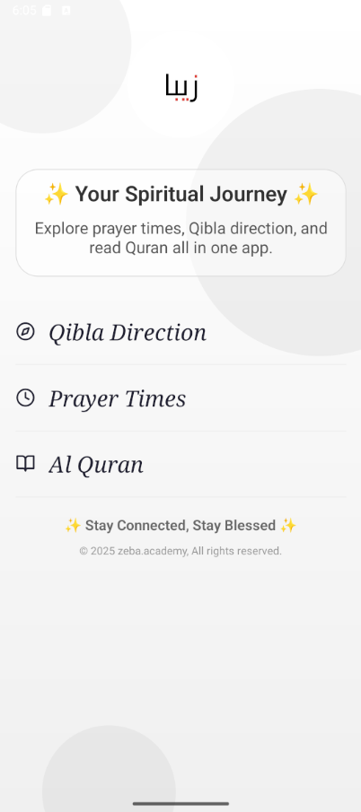
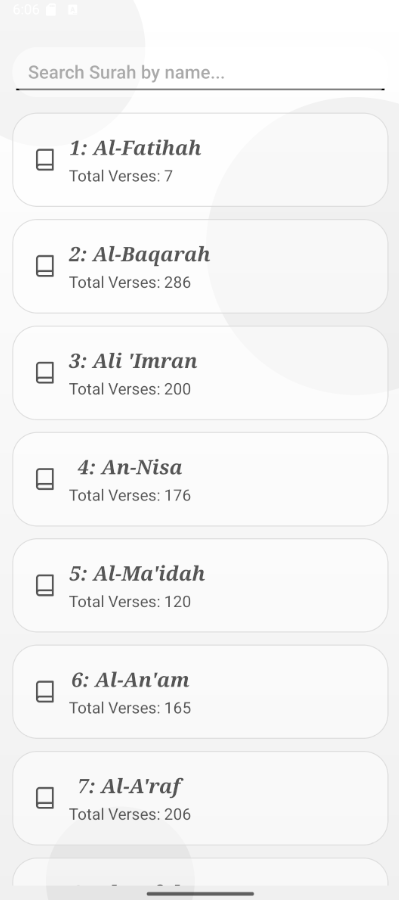
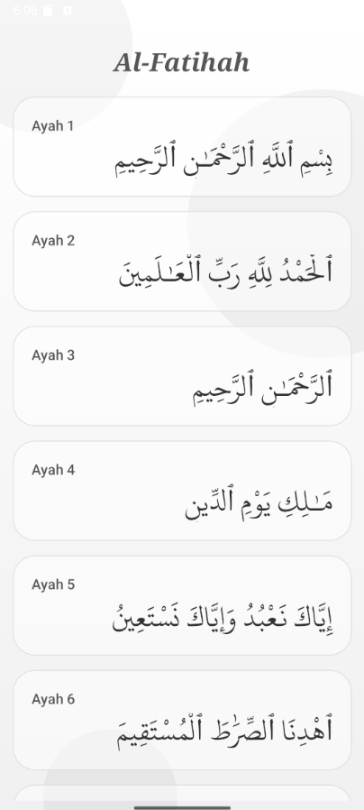
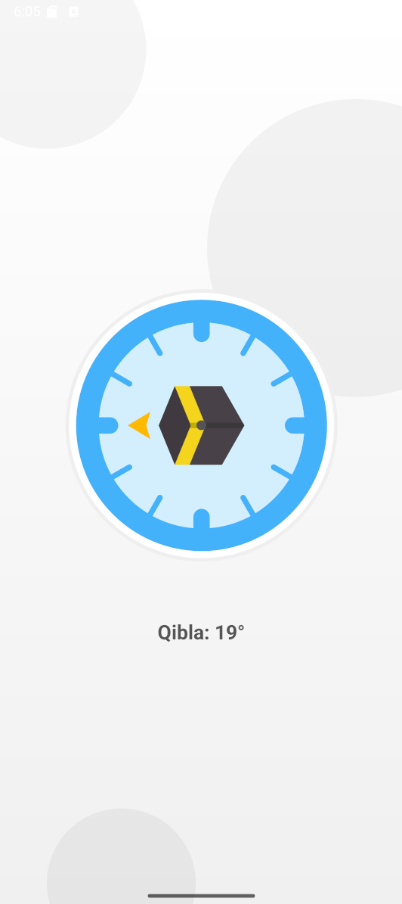
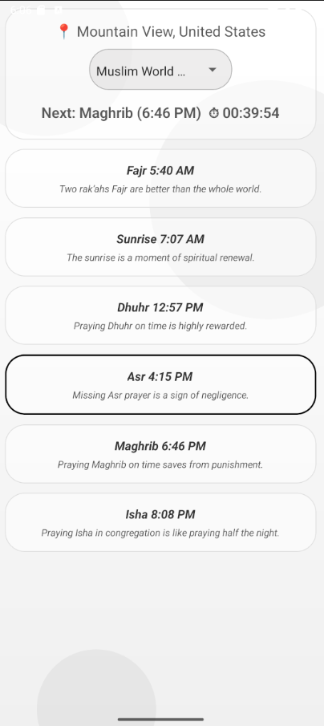

# Muslim App 📱

A React Native mobile application built with [`@react-native-community/cli`](https://github.com/react-native-community/cli).  
This app provides useful Islamic tools and resources such as **Qibla Direction, Surah Reader, Prayer Timings, and more.**  

</br>

## 🌙 Powered by Zeba Books

This app is part of the **Zeba Books** initiative, focused on delivering quality Islamic and educational apps for everyone.  
Visit us at 👉 [zeba.academy](https://zeba.academy)  

</br>

## 🚀 Getting Started

### 1. Clone the repository
```sh
git clone https://github.com/sufyanism/muslim-app.git
cd muslim-app
```

### 2. Install dependencies
```sh
npm install
# OR
yarn install
```

### 3. Start Metro
```sh
npm start
# OR
yarn start
```

### 4. Run the app

#### Android
```sh
npm run android
# OR
yarn android
```

#### iOS
```sh
npm run ios
# OR
yarn ios
```

</br>

## 📸 Screenshots & Pages

### 🏠 Home Screen
The **Home Screen** provides quick access to different features of the app with a clean and simple UI.  

### 📖 Read Screen
The **Read Screen** allows users to read Surahs conveniently. Text is displayed in a clear and readable format.  

### 📚 Suras Screen
The **Suras Screen** lists all Surahs of the Quran so users can easily navigate and select a Surah to read.  

### 🧭 Qibla Direction
The **Qibla Direction Screen** uses the device’s compass to show the accurate direction of Qibla.  

### 🕓 Prayer Timing
The **Prayer Timing Screen** displays daily prayer times along with motivational hadith reminders.  

</br>

## 📸 Screenshots

| Home Screen | Read Screen | Suras Screen |
|-------------|-------------|--------------|
|  |  |  |

| Qibla Direction | Prayer Timing |
|-----------------|---------------|
|  |  |

</br>

## 🛠 Tech Stack

- [React Native](https://reactnative.dev)  
- Metro bundler  
- Android/iOS native build  

</br>

## 👨‍💻 Development

To modify the app, edit `App.tsx`. Thanks to **Fast Refresh**, changes will instantly reflect in your running app.

</br>

## About Me 
✨ I’m **Sufyan bin Uzayr**, an open-source developer passionate about building and sharing meaningful projects.
You can learn more about me and my work at [sufyanism.com](https://sufyanism.com/) or connect with me on [Linkedin](https://www.linkedin.com/in/sufyanism)

</br>

## Your all-in-one learning hub! 
🚀 Explore courses and resources in coding, tech, and development at **zeba.academy** and **code.zeba.academy**. Empower yourself with practical skills through curated tutorials, real-world projects, and hands-on experience. Level up your tech game today! 💻✨

</br>

**Zeba Academy**  is a learning platform dedicated to **coding**, **technology**, and **development**.  
➡ Visit our main site: [zeba.academy](https://zeba.academy)   </br>
➡ Explore hands-on courses and resources at: [code.zeba.academy](https://code.zeba.academy)   </br>
➡ Check out our YouTube for more tutorials: [zeba.academy](https://www.youtube.com/@zeba.academy)  </br>
➡ Follow us on Instagram: [zeba.academy](https://www.instagram.com/zeba.academy/)  </br>

</br>

**Thank you for visiting!** 

